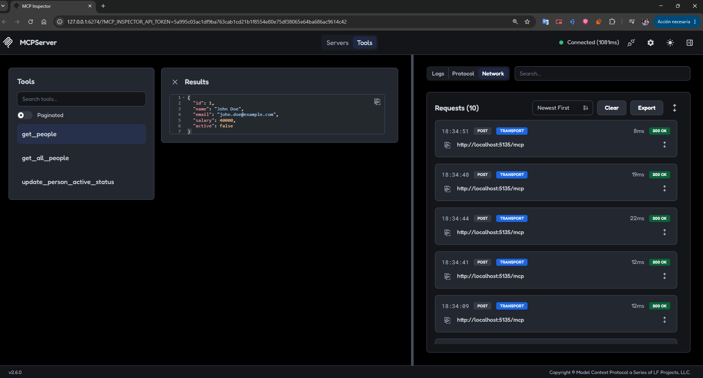

# MCPServer

An example [Model Context Protocol (MCP)](https://modelcontextprotocol.io/) server built with ASP.NET Core and .NET 10. The project exposes an in-memory people directory through MCP tools that an MCP-compatible client can discover and invoke.

## What this project demonstrates

- Creating an MCP server with `ModelContextProtocol.AspNetCore`.
- Hosting MCP over HTTP with the ASP.NET Core HTTP transport.
- Discovering tools from the assembly with `WithToolsFromAssembly()`.
- Registering application services with dependency injection.
- Using an in-memory repository to read and update people.
- Connecting to the server with the MCP Inspector.

## Example

The MCP Inspector can connect to the running server and display the available tools:



## Available MCP tools

| Tool | Parameters | Description |
| --- | --- | --- |
| `GetAllPeople` | None | Returns all registered people. |
| `GetPeople` | `id: int` | Returns one person by ID. An error is returned when the person does not exist. |
| `UpdatePersonActiveStatus` | `id: int`, `isActive: bool` | Activates or deactivates a person and returns a success message. |

Each person contains an ID, name, email address, salary, and active status. The sample repository starts with three records:

| ID | Name | Email | Salary | Active |
| ---: | --- | --- | ---: | :---: |
| 1 | John Doe | john.doe@example.com | 40000 | Yes |
| 2 | Jane Smith | jane.smith@example.com | 45000 | No |
| 3 | Alice Johnson | alice.johnson@example.com | 50000 | Yes |

## Requirements

- .NET 10 SDK
- Node.js and npm, required only for the MCP Inspector
- An MCP-compatible client or the MCP Inspector

## Run the server

From the repository root, start the ASP.NET Core application:

```bash
dotnet run --project MCPServer/MCPServer.csproj
```

The configured development URLs are:

- HTTP: `http://localhost:5135`
- HTTPS: `https://localhost:7018`

The MCP endpoint is available at `/mcp`:

- `http://localhost:5135/mcp`
- `https://localhost:7018/mcp`

## Connect with MCP Inspector

With the server running, launch the inspector in another terminal:

```bash
npx @modelcontextprotocol/inspector@latest
```

When prompted for the server URL, enter one of the MCP endpoint URLs above. The inspector can then list the tools and invoke them with their parameters.

## Project structure

```text
MCPServer/
├── DTOs/                       Operation result models
├── Entities/                   Domain models, including Person
├── Extensions/                 Dependency injection registrations
├── Interfaces/                 Repository contracts
├── Services/                   In-memory people repository
├── Tools/                      MCP tool definitions
├── Program.cs                  Application and MCP server configuration
└── MCPServer.csproj            .NET 10 project configuration
```

## Implementation notes

- The server uses `WithHttpTransport()` and maps MCP to `/mcp`.
- The people repository is registered as a singleton, so updates remain available for the lifetime of the running process.
- Data is stored only in memory and is reset whenever the application restarts.
- CORS is configured to allow any origin, method, and header for local development and demonstration purposes.
- This sample does not include persistent storage, authentication, or authorization.

## License

No license has been specified for this repository.
